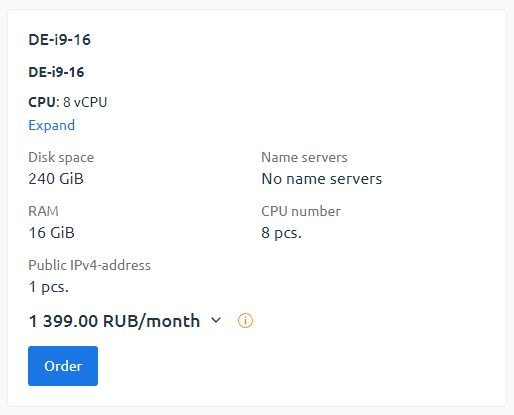
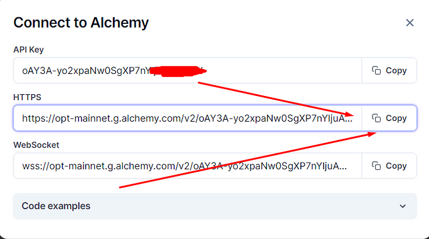

**Рекомендованные требования к серверу из официальной документации Farcaster:**

- 4 CPU(ядра процессора);
- 16 GB RAM(оперативная память);
- 200 GB свободного хранилища на сервере;
- Операционная система Ubuntu 20.04

На [**XorekCloud**](https://xorek.cloud/) арендовать подходящий сервер за **1399** рублей в месяц

- Аеза - https://aeza.net/
- Спейскор - https://billing.spacecore.pro/
- Хорек - https://xorek.cloud/

**[Инструмент для сравнения хостингов](https://ru.hostings.info/hostings/filter_page#servers)** - годная штука

<h3>Подготовка:</h3>

-  Отправляемся к [**Alchemy**](https://www.alchemy.com/) и регистрируем аккаунт
-  Слева тыкаем на **Overview** и справа на **Create new app**

   
-  Выбираем **Ethereum** и **Ethereum Mainnet**
-  Снизу любое значение и тыкаем на **Create App**

   
-  Cправа тыкаем на Api Key

   
- Копируем HTTPS адрес и сохраняем в блокнот или другое надежное место

  
- Повторяем все те же самые действия, только уже выбираем Optimism Mainnet

  
- Сохраняем HTTPS адрес

  

**Далее отправляемся к своему профилю Warpcast и нам нужно скопировать наш FID**

<h3>Идем к терминалу:</h3>
Выполняем команды:

    sudo apt update -y
 

    sudo apt install screen -y
 

    screen --version
 

    screen -S Hubble
 

    curl -sSL https://download.thehubble.xyz/bootstrap.sh | bash

-  Как только все установилось, у Вас появится такое окно с вводом "Ethereum Mainnet RPC URL". 

 
- Вставляем HTTP из Ethereum App, которое копировали в блокнот из Alchemy. 
-  Далее жмем "Enter".

- Таким же образом вставляем Optimism RPC.
- Далее вставляем FID и жмем "Enter". Пойдет установка.

-   Через пару минут появится логи — **значит всё гуд!**
-   Логи можно остановить кнопкой **СNTR+A+D(выход из screen) или CNTR+C**
-   В логах вы увидите снепшоты — они буду расти постепенно
-   Синхронизация займёт около **2–3 часов**

<h3>Открываем порты:</h3>
Эти шаги помогут вам открыть порты 2281, 2282 и 2283 с помощью iptables:

    sudo apt-get install iptables-persistent
  

    sudo iptables -A INPUT -p tcp --dport 2281 -j ACCEPT 
    sudo iptables -A INPUT -p tcp --dport 2282 -j ACCEPT 
    sudo iptables -A INPUT -p tcp --dport 2283 -j ACCEPT
  

     sudo iptables-save > /etc/iptables/rules.v4
 
Чтобы убедиться, что правила были добавлены, выполните:  

    sudo iptables -L -v -n

<h3>Дашборд:</h3>
Переходим к дашборду по ссылке ниже (только заменить Айпи_вашего_сервера на ваш айпишник):

    http://Айпи_вашего_сервера:3000

Проверить свой ip:

    wget -qO- eth0.me

У вас изначально в grafana будет No data и ничего не будет видно

Но спустя несколько часов, у вас будет появляться графики и всё такое (смотрим фрейм за 24 часа)

<h3>Обновление:</h3>
Если у вас в grafana стоит версия 1.13.1 то нужно обновиться, если 1.13.2 - то обновления нам не нужно, оно встало автоматически

**Инструкция по обновлению:**

Заходим на сервер и обновляем пакеты:

    sudo apt update && sudo apt upgrade -y  

Подключаемся к сессии Hubble в screen'e:

    screen -r Hubble  

Обновляем ноду:

    cd ~/hubble && ./hubble.sh upgrade

<h3>RPC</h3>
- У Alchemy лимит 300млн запросов в месяц
- У инфурии лимит 100к запросов в день

Если где-то упираетесь в лимит (с фаркастером не должно быть если он 1 стоит, если рядом с zora или еще пару нод, то мы упираемся в лимиты), тут просто создаем себе новые rpc на Alchemy или инфурия, и меняем в кофиге значения
 

Пример как я это делал с zora, по очереди:

    cd node
 

    export CONDUIT_NETWORK=zora-mainnet  
   

    nano .env
  

**Там где OP_NODE_L1_ETH_RPC= ставишь свой ключ с Ethereum Mainnet**

 

    docker compose down  
    docker compose up --build -d

<h3>FAQ</h3>

**Обязательно к прочтению**, тут ответы на следующие вопросы:
- Если у вас не отображается Inbound Sync Attempts
- Информация о входящих соединениях Gossip
- Если у вас проскальзывают Error в логах
- Если при установке по время синхронизации ноды вы столкнулись с подобной ошибкой
- Blocked Peers

https://telegra.ph/CHasto-zadavaemye-voprosy-po-Farcaster-06-19
