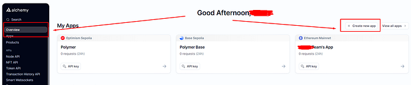
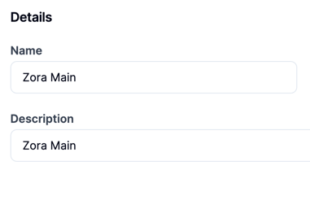
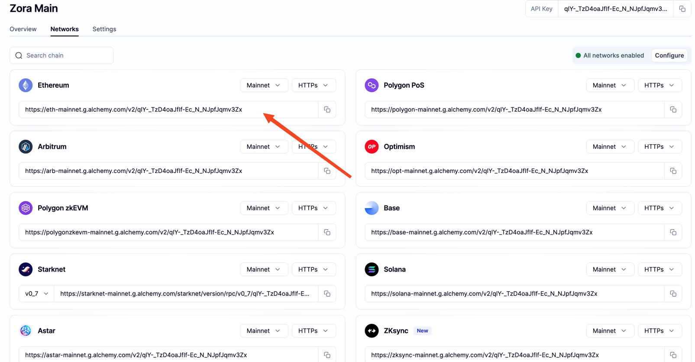
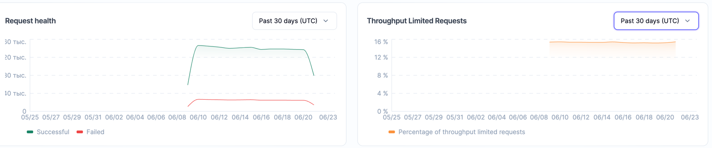

# Zora

**Zora** — это Layer-2 решение на Ethereum и NFT Marketplace. Также они предоставляют различные SDK для разработчиков.

**Характеристики для сервера:**

- **CPU: 4-6 cores;**
- **RAM: 16 GB:**
- **Storage: 200 GB SSD;**
- **OS: Ubuntu 22.04**

*Удобный [сервис](https://ru.hostings.info/hostings/filter_page#vps) для выбора подходящего хостинга*

## Инструкция по установке ноды:

**1. Переходим в [Alchemy](https://www.alchemy.com/), регистрируем аккаунт если ранее этого не сделали. Создаем новое приложение нажав на кнопку Create new app.**



**2. В поле Name указываем Zora, описание добавлять необязательно. Chain и Network оставляем Ethereum и Ethereum Mainnet соответственно.**



**3. После того, как успешно создали приложение переходим к серверу. Выполним обновление пакетов:**

```bash

sudo apt-get update && sudo apt-get upgrade -y

```

**4. Устанавливаем необходимое ПО для работы ноды:**

```bash

sudo apt install curl build-essential git screen jq pkg-config libssl-dev libclang-dev ca-certificates gnupg lsb-release -y

```

**5. Отдельно устанавливаем Docker на сервер. Выполните команды по очереди:**

```bash

sudo mkdir -p /etc/apt/keyrings

```

```bash

curl -fsSL https://download.docker.com/linux/ubuntu/gpg | sudo gpg --dearmor -o /etc/apt/keyrings/docker.gpg

```

```bash

echo "deb [arch=$(dpkg --print-architecture) signed-by=/etc/apt/keyrings/docker.gpg] https://download.docker.com/linux/ubuntu $(lsb_release -cs) stable" | sudo tee /etc/apt/sources.list.d/docker.list > /dev/null

```

```bash

sudo chmod a+r /etc/apt/keyrings/docker.gpg

```

**6. Еще раз обновим пакеты:**

```bash

sudo apt-get update

```

```bash

sudo apt-get install docker-ce docker-ce-cli containerd.io docker-compose

```

**7. Скачиваем ПО Zora:**

```bash

git clone https://github.com/conduitxyz/node.git

```
**8. Переходим в папку Zora:**

```bash

cd node

```

**9. Инициализируем папку:**

```bash

./download-config.py zora-mainnet-0

```

**10.**

```bash

export CONDUIT_NETWORK=zora-mainnet-0

```

**11. Переходим к редактированию файла с API ключами:**

```bash

cp .env.example .env

```

**12. Открываем текстовый файл:**

```bash

nano .env

```

**13. Копируем из Alchemy API key приложения.**



**14. Переходим обратно к файлу. Замените значение "OP_NODE_L1_ETH_RPC" на скопированный ранее API key. В "OP_NODE_L1_BEACON" вставьте ссылку из примера:**

```

# [recommended] replace with your preferred L1 (Ethereum, not Conduit) node RPC URL:
OP_NODE_L1_ETH_RPC=<HTTP://...> <- Ваш API key
OP_NODE_L1_BEACON=https://beaconstate.info/ <- Заполните данное поле как в примере

```

**14. Сохраните файл нажав CTRL+X, далее Y и после Enter.**

**15. Запустите ноду командой:**

```bash

docker compose up --build -d

```

*Подождите подготовку контейнеров*

**16. Вы можете проверить логи командой:**

```bash

docker logs -f node-op-node-1

```

**В Вашем профиле Alchemy отобразится информация об аптайме ноды**




**Так как zora у нас дает огромное количество реквестов,
за 15 дней съело почти половину лимита alchemy,
прийдется следить и менять rpc если не будем попадать в лимиты:**

- У Alchemy лимит 300млн запросов в месяц
- У инфурии лимит 100к запросов в день

Если где-то упираетесь в лимит (с фаркастером не должно быть если он 1 стоит, если рядом с zora или еще пару нод, то мы упираемся в лимиты), тут просто создаем себе новые rpc на Alchemy или инфурия, и меняем в кофиге значения
<br>

Пример как я это делал с zora, по очереди:


    cd node
<br>

    export CONDUIT_NETWORK=zora-mainnet  
<br>  

    nano .env
 <br>

**Там где OP_NODE_L1_ETH_RPC= ставишь свой ключ с Ethereum Mainnet**

<br>

    docker compose down  
    docker compose up --build -d


